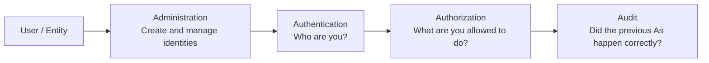

# Identity & Access Management (IAM)

This wiki explains the **Identity and Access Management (IAM)** domain of cybersecurity architecture.

The main idea is simple:

> **Identity is the new perimeter.**

Modern environments are distributed: employees work from home, applications run in the cloud, users access SaaS systems, and partners connect across organizations. Because of that, relying only on a network perimeter is not enough.

You need to identify the user or system **as early as possible**, then control what that identity is allowed to do.

---

## The Four As of IAM

IAM is usually explained using the **Four As**:

| A | Question it answers | What it means |
|---|---|---|
| **Administration** | What access should this user have? | Creating, updating, deleting, and managing identities and access rights |
| **Authentication** | Who are you? | Proving the identity of the user or system |
| **Authorization** | What are you allowed to do? | Deciding whether a specific action or access request is allowed |
| **Audit** | Did the previous As happen correctly? | Logging, monitoring, reviewing, and detecting mistakes or abuse |

---

## What this wiki covers

- The foundation of IAM: storing and synchronizing identity data
- The role of directories, LDAP, Active Directory, virtual directories, and meta directories
- Identity administration, identity governance, role management, and provisioning
- Authentication, multi-factor authentication, passwordless trends, and single sign-on
- Authorization and risk-based access
- Privileged access management
- Audit, logging, and user behavior analytics
- Federation, enterprise IAM, workforce identity, and consumer IAM

---

## How to read this wiki

1. [Introduction to IAM](/wiki/1-Introduction)
2. [IAM Foundations: Directories and Sync](/wiki/2-IAM-Foundations)
3. [Administration / Identity Governance](/wiki/3-Administration-Identity-Governance)
4. [Authentication and Single Sign-On](/wiki/4-Authentication-and-Single-Sign-On)
5. [Authorization and Risk-Based Access](/wiki/5-Authorization-and-Risk-Based-Access)
6. [Privileged Access Management](/wiki/6-Privileged-Access-Management)
7. [Audit and User Behavior Analytics](/wiki/7-Audit-and-User-Behavior-Analytics)
8. [Federation, Enterprise IAM, and CIAM](/wiki/8-Federation-Enterprise-and-CIAM)
9. [Reference Architecture](/wiki/9-Reference-Architecture)

---

## Quick glossary

| Term | Meaning |
|---|---|
| **Identity** | Information that describes a user, device, or system |
| **Directory** | A place where identity and account information is stored |
| **LDAP** | A common protocol for querying and managing directory data |
| **Active Directory** | Microsoft’s directory implementation, commonly used in enterprises |
| **Provisioning** | Creating and granting access |
| **De-provisioning** | Removing access when it is no longer needed |
| **Role** | A set of access rights assigned based on a job or function |
| **SSO** | Single sign-on, where one authentication allows access to multiple systems |
| **MFA** | Multi-factor authentication, using two or more identity factors |
| **PAM** | Privileged access management for highly privileged accounts |
| **UBA / UEBA** | User behavior analytics / user and entity behavior analytics |
| **Federation** | Trusting identity across different organizations or identity domains |

---

## Start here

[1. Introduction to IAM](/wiki/1-Introduction)
